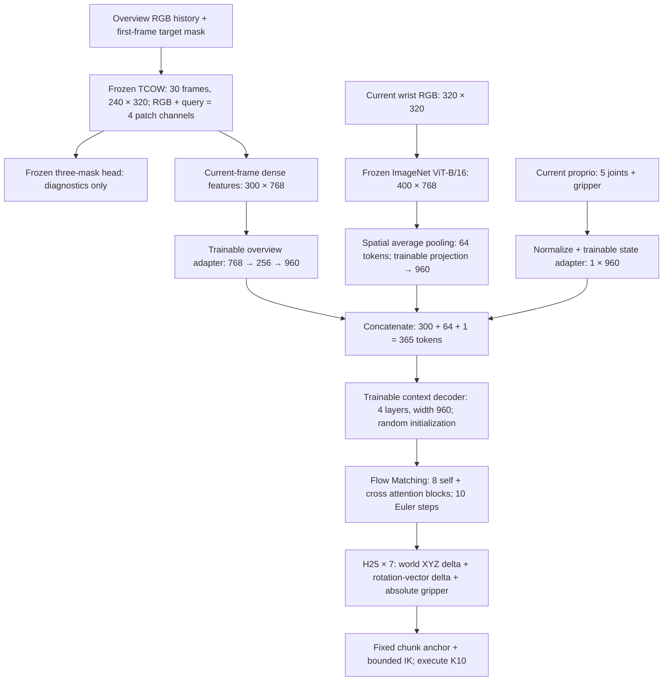

# OAT-Flow

**Occlusion-Aware Tracking-conditioned Flow Policy (OAT-Flow)** combines
target-conditioned RGB history tracking, current wrist vision and
proprioception to generate manipulation action chunks with flow matching.
Memory occlusion is the task; OAT-Flow is the policy architecture.

## Task

A five-joint NexArm with a gripper must remember a queried object through
occlusion and cover shuffling, remove its cover to the green drop zone, then
pick the object and place it in the blue drop zone. The MuJoCo scene contains
four HOPE objects (Butter, Popcorn, Milk, Tuna) and two visually identical
covers, each hiding two objects.

Each episode has two phases:

1. **Video context:** reveal the objects, cover them, shuffle the covers and
   pause. The arm stays still; `action_valid=False`.
2. **Manipulation, starting at `t_occ`:** remove the correct cover and pick/place
   the queried object; expert commands have `action_valid=True`.

The policy receives overview RGB history, a **visible ground-truth target
mask on the first frame**, current wrist RGB and current proprioception.
Later ground-truth masks, object/cover IDs, assignments and world poses are
supervision or diagnostic data only. Reference close-up query images are saved
with the dataset but are not inputs to the active TCOW–flow policy.

Context motion is scripted: covers and their hidden objects translate together.
Expert manipulation uses `controllers/oracle_pick.py` with MuJoCo contacts,
without attaching bodies to the gripper. A recorded grasp requires both jaws
touching the body and a lift of at least 1 cm for three consecutive 25 Hz frames.

## OAT-Flow architecture

Current configuration: frozen TCOW and ImageNet ViT-B/16, 64 wrist tokens,
a four-layer context decoder initialized from scratch, and an EE-delta action head.
New training uses RGB only; depth is absent from the model and loader.



| Branch | Representation |
| --- | --- |
| TCOW | Original 12-block causal TimeSformer; RGB plus query. Initializing from an RGB-D checkpoint retains kernels 0/1/2/4 and discards depth kernel 3; all other TCOW tensors are unchanged. Vendor code is unchanged. |
| Overview adapter | LayerNorm → Linear 768→256 → SiLU → Linear 256→960 at each of the 300 spatial locations. |
| Wrist | Frozen ImageNet ViT-B/16, 20×20 spatial grid pooled to 8×8; trainable projection to width 960. |
| Proprio | Six normalized joint/gripper values through the state adapter: one token. |
| Context decoder | 365 tokens, width 960, four layers; RMSNorm, RoPE, GQA and gated MLP; bidirectional attention over observations available now. |
| Flow Matching | Pretrained action expert: 16 layers paired into eight self/cross-attention blocks; width 720, action/state padding to 32. EE-delta uses seven action coordinates and six proprio coordinates. |

TCOW supplies dense current-frame features; predicted masks do not enter FM.
TCOW and wrist encoders remain frozen when using `--flow-only --contextualize
--freeze-wrist-encoder`. Decoder, adapters and FM train with action loss.

Removing depth changes hidden features even with frozen remaining weights:
RGB-only FM needs a fresh training run. Historical RGB-D checkpoints retain their
original architecture during evaluation; restoration never silently drops depth.
See [policy details and run commands](policy/README.md).

## History and closed loop

Both cameras and expert actions are recorded at **25 Hz**. Overview inputs are
240×320, cropped from the simulator's 320×320 overview; wrist inputs use the
full 320×320 image.

At each training endpoint or policy replan at frame `t`, the loader selects
`round(linspace(0, t, 30))`: 30 frames spanning the first query frame through
the current observation. Early prefixes repeat frame indices. The query mask
occupies only the first sampled frame. This is temporal subsampling of the
whole prefix; the 30 selected frames are not necessarily adjacent at 25 Hz.

TCOW recomputes features from this prefix on every replan. It does not carry a
recurrent hidden state or reuse hidden features from the previous policy call.
The transformer input stays at 30 frames; the stored raw observation history
grows with episode duration.

Closed-loop evaluation first records the reveal/shuffle context and processes
its prefixes through TCOW. During manipulation, it predicts **H=25** actions,
executes **K=10** by default, appends the new observations and replans:

```text
t:      predict a[t:t+25]       → execute a[t:t+10]
t+10:   predict a[t+10:t+35]    → execute a[t+10:t+20]
```

Predicted chunks overlap; executed segments do not. K10 corresponds to one
policy/TCOW replan every 0.4 s, with simulator observations/actions at 25 Hz.
Current wrist features are computed once per prediction, outside the ten-step
Euler integration loop. `rollout.py --execute-chunk` allows K from 1 to 25;
`--max-total-frames` includes context as well as manipulation. Visualization
shows overview RGB, the three predicted masks and wrist RGB.

## Dataset and training flow

```text
Frozen scene_plan.jsonl
  → simulate complete expert episodes, record both RGB cameras/actions/masks
  → audit every episode and write manifest.jsonl
  → finalize absolute or delta actions
  → fit normalization using standard TRAIN only
  → index context endpoints and action chunk starts every 10 frames
  → native DataLoader: LeRobot frame decoding, cluster/phase minibatch order
  → train decoder/adapters/FM with frozen TCOW and wrist
  → save epoch checkpoint; evaluate closed loop separately
```

The frozen plan contains 220 scenes with four target queries per scene:
**880 episodes**. Scene seeds are disjoint across train, validation and tests.

| Split | Scenes | Episodes |
| --- | ---: | ---: |
| Standard train | 160 | 640 |
| Standard validation | 20 | 80 |
| Standard test | 20 | 80 |
| Composition test | 20 | 80 |

Composition scenes reserve the combinations `Butter / cover_b / 3 swaps` and
`Tuna / cover_a / 1 swap` from standard data. All four queries are recorded
per composition scene; **20 of the 80 episodes** are specifically marked
`is_held_out_query`. The test objects themselves also appear in training.

Scenes vary object placement/cover assignment and one to three swaps.
Each context plan varies swap duration, arc, direction, speed, pauses and
endpoints. Four queries of a scene share its context plan; they are different
target-conditioned demonstrations, not four independently perturbed contexts.

### Files per episode

| File | Contents |
| --- | --- |
| `rgb.mp4` | Complete 25 Hz overview RGB, 240×320 |
| `wrist_rgb.mp4` | Synchronized 25 Hz wrist RGB, 320×320 |
| `observation.npz` | Normalized joint positions and timestamps; new collections contain no depth |
| `query_mask.png` | Visible target mask on frame zero |
| `tcow_labels.npz` | Three binary channels: target amodal, frontmost occluder, outermost container |
| `supervision.npz` | Absolute expert commands, action validity, phases, semantic masks and grasp events |
| `relative_actions.npz` | Delta mode only: H25 chunks, start indices, fixed anchors and valid-step masks |
| `episode.json` | Scene/camera/context metadata, decision times, sim assignments and outcomes |
| `input.json` | Observation paths and decision boundaries |
| `debug_poses.npz` | Privileged body poses and simulator joint positions for diagnostics |

At dataset root, `plan.jsonl`, `manifest.jsonl`, `audit.json`,
`normalization.json` and `dataset.json` describe collection, splits and action
conventions. The active policy trains on the three TCOW mask channels;
`supervision.npz/mask` is a separate task-relevance label.

### Actions and normalization

The first five arm positions/absolute commands are mapped by actuator limits
to [-1,1]; gripper is [0,1], where 0 is closed and 1 is open.
The generator supports `--action-mode absolute|delta`.

For delta chunks starting at `t`:

```text
target[k, :5] = expert_command[t+k, :5] - observed_proprio[t, :5]
target[k,  5] = expert_command[t+k,  5]       # absolute gripper
```

The observed anchor at `t` is fixed for all 25 actions. These are offsets
from the chunk-start state, not differences between successive actions.
TRAIN mean/std normalization is applied to state and action values inside
the policy. Inference reverses action normalization and, in delta mode,
adds the same observed anchor back to the five arm coordinates before execution.
Original absolute expert labels are retained in each delta episode.

### Loss and sampling

Both context endpoints and valid action starts use stride 10. The last context
frame before `t_occ` is included even if it falls off that grid. Short final
action chunks are padded; padded/invalid steps are excluded from action loss.
Every epoch covers the indexed samples, shuffled within episode clusters.

| Sample | Forward path | Joint-training objective |
| --- | --- | --- |
| Before `t_occ`, no valid actions | TCOW and three-mask head; skip wrist encoder and FM | 0.2 × original TCOW mask loss |
| At/after `t_occ`, valid actions | TCOW, mask head, wrist encoder and FM | Action velocity MSE + 0.2 × original TCOW mask loss |

Mask loss supervises the 30 sampled history frames. Action loss supervises
the valid future action coordinates (seven for EE-delta). Flow time sampling uses
Beta(1.5,1), sinusoidal time embedding and the reference model's time/velocity
convention adapted to noise at t=0. Inference uses ten Euler steps.

`--flow-only` freezes TCOW and its mask head, drops context-only samples and
mask loss. `--freeze-wrist-encoder` also freezes wrist vision; adapters, context
decoder and FM remain trainable.
Both trainers use native PyTorch DataLoader workers and LeRobot/TorchCodec
decoding. Compressed train videos are cached once in RAM; DDP ranks share that
cache and decode only their requested history/current-wrist frames. Each rank
uses native worker/prefetch controls: single GPU has two workers/factor two;
DDP has one worker/factor one and unpinned CPU batches to fit its RAM budget.
Global batches and weighted short
tails remain synchronized; manual episode/cluster prefetch has been removed.

Training skips validation and automatic rollout. Use the completed `final.pt`
for a separate closed-loop test; test splits do not select checkpoints.

## Generate data

From the repository root, use the project `.venv`:

```bash
OMP_NUM_THREADS=1 OPENBLAS_NUM_THREADS=1 MKL_NUM_THREADS=1 \
.venv/bin/python -m OATFlow.dataset.generate_dataset \
  --plan OATFlow/dataset/scene_plan.jsonl \
  --output /path/to/datasets/e09_data \
  --action-mode delta --workers 8
```

For absolute commands, use `--action-mode absolute` and a fresh output directory.
The command runs collection, full audit and normalization; long stages show
tqdm progress. Existing output directories and failed expert rollouts are
rejected. Robot grasp/contact parameters are simulation settings.

To collect extra demonstrations in the same command, add `--extra-demos 3`
with `--action-mode delta` or `--action-mode ee`. The default `--extra-demos 0` collects only the
original demonstrations; `2` requests exactly two successful extras per train
sample, while `3` requests up to three and requires at least two. TCOW labels
are enabled automatically. Each worker collects one expert episode, validates
it, then immediately collects that sample's extra demonstrations before starting
another sample. There is no separate augmentation pass when generating new data.
Extra rollouts run continuous expert-plus-joint perturbation from shuffle end,
with physical grasp/placement retries. Labels are the
actually executed commands (type 2), and each demo retains its own full
RGB/wrist/proprio history and H25 joint/EE-delta chunks at stride 10.

Successful extras are attached under each train episode's `demos/a01`–`a03`
and indexed in `demonstrations.json`; the existing training loaders consume
them automatically. Validation/test episodes receive no extra demonstrations.
After full dataset audit, normalization is fitted once on the original
and extra standard/train demonstrations together. Fewer than two successful extras after 12 trials causes a
reported shortfall and nonzero exit. Configuration, README and results are
written beside the data, with augmentation progress in
`augmentation/{config.json,summary.json,scenes/,scene_logs/}`.

Use `--action-mode ee` to generate EE-delta labels directly for both original
and extra demonstrations. `ee_actions.npz` stores H25 fixed-anchor world XYZ
(metres), rotation-vector delta (radians) and absolute gripper (7D), plus joint6
proprioception and anchor poses. Labels use FK of the actual executed actuator
commands, including gravity compensation. Absolute joint labels remain in
`supervision.npz`; EE datasets do not write `relative_actions.npz`.
Normalization uses valid H25 steps from standard/train only, including successful
extra demonstrations; validation/test data never contribute.

```bash
CUDA_VISIBLE_DEVICES=0 MUJOCO_GL=egl PYOPENGL_PLATFORM=egl \
OMP_NUM_THREADS=1 OPENBLAS_NUM_THREADS=1 MKL_NUM_THREADS=1 \
taskset -c 0-7 python -u -m OATFlow.dataset.generate_dataset \
  --plan OATFlow/dataset/scene_plan.jsonl --action-mode ee --extra-demos 2 \
  --workers 4 --output /workspace/datasets/e14_ee2
```

This collects 880 base episodes and exactly two successful extra demos per
640 standard/train episodes (1,280 extra; 2,160 total). Training sees 1,920
train demonstrations per epoch. Run in `huy` tmux through `tee` to save logs.

On the persistent server volume, activate the environment and use dataset/
checkpoint paths under `/workspace/memory_occlusion`; see
[policy setup and commands](policy/README.md). Training and closed-loop options
are documented beside their source modules.

## Code map

| Directory/file | Role |
| --- | --- |
| `environment/`, `task.py` | Simulator, observations, task rules and joint-limit conversion |
| `dataset/episode.py`, `dataset/generate_dataset.py` | Expert collection and full dataset generation |
| `dataset/actions.py`, `dataset/audit_tcow_dataset.py` | Action conversion/normalization and dataset audit |
| `policy/model.py` | Complete policy architecture and checkpoint restoration |
| `policy/tracking.py` | Upstream TCOW integration and original mask loss |
| `policy/data.py`, `policy/loader.py` | Action chunks, LeRobot decoding and native DataLoader |
| `policy/train.py`, `policy/train_distributed.py` | CUDA/MPS and distributed training |
| `policy/rollout.py`, `policy/visualization.py` | Live closed-loop evaluation and video panels |
