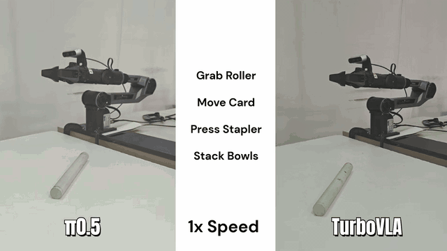
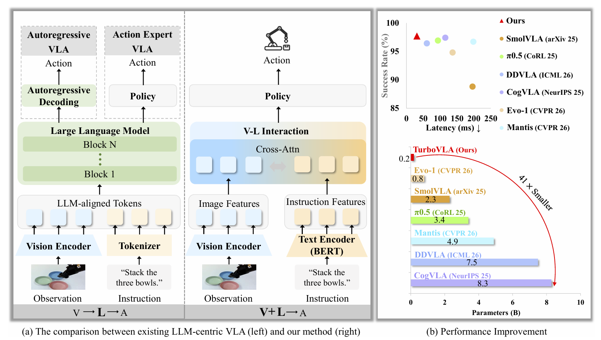
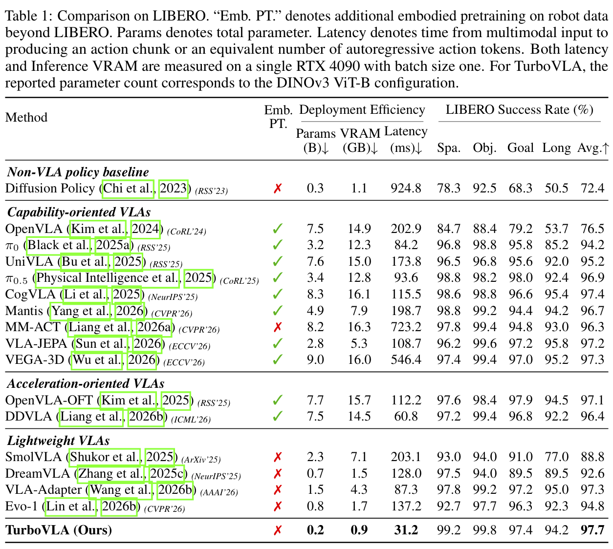

# TurboVLA: Real-Time Vision-Language-Action Model at 32 Hz on an RTX 4090 with &lt;1 GB VRAM

<div align="center">
  <a href="https://arxiv.org/abs/2607.27205"></a>
  <a href="https://h-embodvis.github.io/TurboVLA/"></a>
  <a href="https://github.com/H-EmbodVis/TurboVLA"></a>
  <a href="https://huggingface.co/H-EmbodVis/TurboVLA"></a>
  <a href="LICENSE"></a>

  <h4><em>Hengyi Xie<sup>1*</sup>, Chenfei Yao<sup>1*</sup>, Xianjin Wu<sup>1</sup>, Xuanyang Xi<sup>2</sup>, Yiping Tang<sup>2</sup>, Di Xu<sup>2</sup>, Yingying Zhu<sup>1</sup>, <a href="https://dk-liang.github.io/">Dingkang Liang</a><sup>1&dagger;</sup>, <a href="https://scholar.google.com/citations?user=UeltiQ4AAAAJ&hl=en">Xiang Bai</a><sup>1</sup>, Han Ding<sup>1</sup></em></h4>

  <sup>1</sup> Huazhong University of Science and Technology, China<br>
  <sup>2</sup> Huawei Technologies Co. Ltd, China<br>
  <sup>*</sup> Equal contribution, listed alphabetically by surname. <sup>&dagger;</sup> Project Lead.
</div>

This repository contains the official implementation of **TurboVLA** for the paper **TurboVLA: Real-Time Vision-Language-Action Model at 32 Hz on an RTX 4090 with &lt;1 GB VRAM**.

<div align="center">
  
  <br>
  <sub><b>Real-world tasks with synchronous policy inference.</b></sub>
</div>


---

## 📣 News

- `2026.07.31`: Released the TurboVLA model checkpoints on [Hugging Face](https://huggingface.co/H-EmbodVis/TurboVLA).
- `2026.07.30`: Released the paper, training and evaluation code.

## 📅 TODO
* [ ] Support Huawei Ascend NPUs
---

## 📄 Abstract

Vision-language-action (VLA) models commonly adopt an LLM-centric V &rarr; L &rarr; A pathway, where visual observations are projected into the representation space of a large language model before being decoded into robot actions. Although effective, this design incurs substantial computation and memory overhead at every policy invocation.

In this work, we introduce **TurboVLA**, a new VLA paradigm that reformulates the conventional V &rarr; L &rarr; A pathway as a direct V + L &rarr; A mapping. Instead of using a large language model as the central interface between perception and action, TurboVLA independently encodes visual observations and language instructions, directly exchanges information between them through lightweight bidirectional vision-language interaction, and predicts continuous action chunks with a compact decoder. This simple design constructs task-conditioned representations directly from visual and linguistic features, significantly reducing the computational and memory costs of VLA inference. On LIBERO, TurboVLA achieves 97.7% average success with only 0.2B parameters, 31.2 ms inference latency, and 0.9 GB inference VRAM on a consumer-grade RTX 4090, matching or outperforming substantially larger VLA policies. These results establish TurboVLA as a simple and effective alternative to the prevailing LLM-centric VLA paradigm, offering a new perspective on how vision, language, and action can be connected for efficient robotic manipulation.

<div align="center">
  <a href="assets/figures/paradigm-and-performance.png">
    
  </a>
</div>

---

## 🔍 Overview

<div align="center">
  <a href="assets/figures/architecture-overview.png">
    
  </a>
</div>


---

## 📈 Performance

<div align="center">
  <a href="assets/figures/performance.png">
    
  </a>
</div>

---

## ⚙️ Installation

Clone the repository:

```bash
git clone https://github.com/H-EmbodVis/TurboVLA.git
cd TurboVLA
```

LIBERO and RoboTwin use different simulator and data stacks. We recommend separate Python 3.10 environments.

### LIBERO Environment

```bash
conda create -n turbovla-libero python=3.10 -y
conda activate turbovla-libero

# Install the CUDA-compatible PyTorch build for your system first.
pip install torch==2.3.1 torchvision==0.18.1 --index-url https://download.pytorch.org/whl/cu121
pip install -e ".[libero]"
```

Install [LIBERO](https://github.com/Lifelong-Robot-Learning/LIBERO) separately in the same environment.

### RoboTwin Environment

```bash
conda create -n turbovla-robotwin python=3.10 -y
conda activate turbovla-robotwin

# Install a CUDA-compatible PyTorch build before the project dependencies.
pip install -e ".[robotwin]"
pip install flash-attn==2.7.4.post1 --no-build-isolation
```

Install the [RoboTwin 2.0](https://github.com/robotwin-Platform/RoboTwin) simulator in a separate evaluation environment when required by your setup.

---

## 📦 Dataset and Model Preparation

Model weights and benchmark datasets are external assets and are not committed to this repository.

### Pretrained Checkpoints

Download the complete TurboVLA release, including model weights and normalization metadata, from [Hugging Face](https://huggingface.co/H-EmbodVis/TurboVLA):

```bash
pip install -U huggingface_hub
hf download H-EmbodVis/TurboVLA \
  --local-dir pretrained/TurboVLA
```

### Required Models

| Asset | Source | Used by |
| --- | --- | --- |
| DINOv3 ViT-B | [facebookresearch/dinov3](https://github.com/facebookresearch/dinov3) | LIBERO |
| DINOv3 ViT-L | [facebookresearch/dinov3](https://github.com/facebookresearch/dinov3) | RoboTwin |
| BERT base uncased | [google-research/bert](https://github.com/google-research/bert) | Both |
| GroundingDINO Swin-T OGC | [IDEA-Research/GroundingDINO](https://github.com/IDEA-Research/GroundingDINO) | Both |

### LIBERO Data

TurboVLA expects the four modified no-noops suites in TFDS/RLDS format:

```text
data/libero/
|-- libero_10_no_noops/1.0.0/
|-- libero_goal_no_noops/1.0.0/
|-- libero_object_no_noops/1.0.0/
`-- libero_spatial_no_noops/1.0.0/
```

The repository provides no-op removal and mixed-suite statistics utilities:

```bash
python scripts/libero/regenerate_libero_no_noops.py --help
python scripts/libero/compute_mixed_stats.py --help
```

Released normalization statistics are stored in `experiments/libero/configs/libero_all4_stats.json`. BERT is part of the model and runs online during both training and evaluation; no text-feature cache is required. See [experiments/libero/README.md](experiments/libero/README.md) for details.

### RoboTwin Data

Download the clean LeRobot dataset and create the expected local link:

```bash
bash scripts/robotwin/prepare_data.sh /path/to/storage
export ROBOTWIN_DATA_ROOT="$PWD/playground/Datasets/RoboTwin"
```

The default downloader uses [StarVLA/RoboTwin-Clean](https://huggingface.co/datasets/StarVLA/RoboTwin-Clean). The training registry expects all 50 datasets under `Clean/<task_name>`.

---

## 🏋️ Training and Evaluation

### LIBERO Training

The paper recipe uses DINOv3 ViT-B, two camera views, 7-D actions, a 12-step action chunk, 80k optimizer steps, 10k warmup steps, and global batch size 256 on four GPUs.

```bash
torchrun --nproc_per_node=4 experiments/libero/train.py \
  --dataset_dir data/libero/libero_10_no_noops/1.0.0 \
  --dataset_dirs "data/libero/libero_10_no_noops/1.0.0,data/libero/libero_goal_no_noops/1.0.0,data/libero/libero_object_no_noops/1.0.0,data/libero/libero_spatial_no_noops/1.0.0" \
  --stats_path experiments/libero/configs/libero_all4_stats.json \
  --stats_key libero_all4_no_noops \
  --dinov3_path facebook/dinov3-vitb16-pretrain-lvd1689m \
  --bert_path google-bert/bert-base-uncased \
  --allow_hf_download \
  --pretrained_init_ckpt /path/to/groundingdino_swint_ogc.pth \
  --checkpoint_dir outputs/libero
```

### LIBERO Evaluation

One command evaluates one checkpoint on one suite.

```bash
python experiments/libero/evaluate.py \
  --ckpt_path pretrained/TurboVLA/checkpoints/libero/libero_object.pth \
  --dinov3_path /path/to/dinov3-vitb \
  --bert_path /path/to/bert-base-uncased \
  --stats_path experiments/libero/configs/libero_all4_stats.json \
  --stats_key libero_all4_no_noops \
  --task_suite_name libero_object \
  --num_trials_per_task 50 \
  --chunk_size 12 \
  --num_open_loop_steps 12 \
  --seed 7 \
  --precision bf16 \
  --result_json_path outputs/evaluation/libero_object.json
```

Valid suite names are `libero_spatial`, `libero_object`, `libero_goal`, and `libero_10`.

### RoboTwin Training

The paper recipe uses DINOv3 ViT-L, three camera views, 14-D absolute joint-position actions, a 50-step ACT head, global batch size 192, and 55k optimizer steps on four GPUs.

```bash
export ROBOTWIN_DATA_ROOT="$PWD/playground/Datasets/RoboTwin"
export BERT_MODEL_PATH=/path/to/bert-base-uncased
export TURBOVLA_INIT_CKPT=/path/to/groundingdino_swint_ogc.pth
export DINOV3_MODEL_PATH=/path/to/dinov3-vitl
export CUDA_VISIBLE_DEVICES=0,1,2,3

MAX_TRAIN_STEPS=55000 \
RUN_ID=turbovla_robotwin_clean50_55k \
bash scripts/robotwin/train.sh
```

### RoboTwin Evaluation

The policy server and RoboTwin simulator can run in separate Python environments:

```bash
export ROBOTWIN_PATH=/path/to/RoboTwin
export STARVLA_PYTHON=/path/to/policy-env/bin/python
export ROBOTWIN_PYTHON=/path/to/robotwin-env/bin/python
export CUDA_VISIBLE_DEVICES=0,1,2,3

ROBOTWIN_TEST_NUM=100 \
bash scripts/robotwin/evaluate.sh \
  pretrained/TurboVLA/checkpoints/robotwin/steps_55000_ema_model.safetensors
```

Append task names to the evaluation command to run a subset. Omitting them evaluates all 50 clean tasks.

---

## 👍 Acknowledgement

TurboVLA builds upon the following projects and resources:

- [DINOv3](https://github.com/facebookresearch/dinov3) for visual representations.
- [GroundingDINO](https://github.com/IDEA-Research/GroundingDINO) for bidirectional vision-language interaction components and initialization.
- [VLA-Adapter](https://github.com/OpenHelix-Team/VLA-Adapter) for the LIBERO task and episode rollout protocol.
- [StarVLA](https://github.com/StarVLA/StarVLA) for the RoboTwin-compatible training and evaluation runtime.
- [LIBERO](https://github.com/Lifelong-Robot-Learning/LIBERO) and [RoboTwin 2.0](https://github.com/robotwin-Platform/RoboTwin) for simulation benchmarks.

---

## 📖 Citation

If TurboVLA is useful in your research, please consider citing the paper:

```bibtex
@article{xie2026turbovla,
  title  = {TurboVLA: Real-Time Vision-Language-Action Model at
            32 Hz on an RTX 4090 with <1 GB VRAM},
  author = {Xie, Hengyi and Yao, Chenfei and Wu, Xianjin and
            Xi, Xuanyang and Tang, Yiping and Xu, Di and
            Zhu, Yingying and Liang, Dingkang and Bai, Xiang and
            Ding, Han},
  journal = {arXiv preprint arXiv:2607.27205},
  year   = {2026}
}
```
