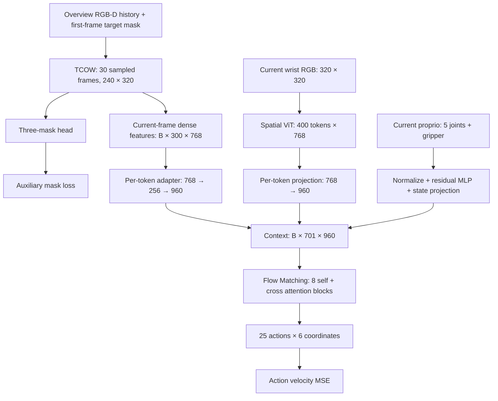

# Memory occlusion

## Task

A five-joint NexArm with a gripper must remember a queried object through
occlusion and cover shuffling, remove its cover to the green drop zone, then
pick the object and place it in the blue drop zone. The MuJoCo scene contains
four HOPE objects (Butter, Popcorn, Milk, Tuna) and two visually identical
covers, each hiding two objects.

Each episode has two phases:

1. **Video context:** reveal the objects, cover them, shuffle the covers and
   pause. The arm stays still; `action_valid=False`.
2. **Manipulation, starting at `t_occ`:** remove the correct cover and pick/place
   the queried object; expert commands have `action_valid=True`.

The policy receives overview RGB-D history, a **visible ground-truth target
mask on the first frame**, current wrist RGB and current proprioception.
Later ground-truth masks, object/cover IDs, assignments and world poses are
supervision or diagnostic data only. Reference close-up query images are saved
with the dataset but are not inputs to the active TCOW–flow policy.

Context motion is scripted: covers and their hidden objects translate together.
Expert manipulation uses `controllers/oracle_pick.py` with MuJoCo contacts,
without attaching bodies to the gripper. A recorded grasp requires both jaws
touching the body and a lift of at least 1 cm for three consecutive 25 Hz frames.

## Current architecture



| Branch | Representation |
| --- | --- |
| TCOW | Original 12-block causal TimeSformer; RGB-D plus query input. The added depth channel starts at zero; original RGB/query weights are preserved. Vendor source is unchanged. |
| Overview adapter | LayerNorm → Linear 768→256 → SiLU → Linear 256→960, independently at each of the 300 spatial locations (15×20). |
| Wrist | A separate 12-block spatial ViT initialized from TCOW RGB patch, spatial attention/MLP and positional weights. Position embeddings are resized to 20×20. All 400 patch tokens are retained; CLS is used internally and discarded at output. |
| Proprio | Six normalized joint/gripper values → MLP 6→128→256→32, added to the state padded to 32 values → pretrained Linear 32→960: one state token. |
| Policy context | 300 overview + 400 wrist + 1 proprio = **701 tokens**, width 960. |
| Flow Matching | 16 pretrained action layers paired into 8 blocks: action self-attention → MLP → cross-attention to all context tokens → MLP. Expert width 720; each noisy action is padded from 6 to 32 values internally. |

TCOW sends dense features from the current frame to the policy. No global
pooling, CLS token or predicted mask is used as policy context. The overview
adapter changes feature width while retaining all spatial locations.

Original TCOW weights and the action expert from `lerobot/smolvla_base`
initialize joint training. The wrist encoder copies TCOW spatial weights once,
then trains independently. The project's dense interaction replaces the
reference model's VLM context; its full VLM is not loaded into this policy.
See [policy details](experiments/tcow_joint_flow/README.md) and
[persistent runtime and pretrained paths](runtime/README.md).

## History and closed loop

Both cameras and expert actions are recorded at **25 Hz**. Overview inputs are
240×320, cropped from the simulator's 320×320 overview; wrist inputs use the
full 320×320 image.

At each training endpoint or policy replan at frame `t`, the loader selects
`round(linspace(0, t, 30))`: 30 frames spanning the first query frame through
the current observation. Early prefixes repeat frame indices. The query mask
occupies only the first sampled frame. This is temporal subsampling of the
whole prefix; the 30 selected frames are not necessarily adjacent at 25 Hz.

TCOW recomputes features from this prefix on every replan. It does not carry a
recurrent hidden state or reuse hidden features from the previous policy call.
The transformer input stays at 30 frames; the stored raw observation history
grows with episode duration.

Closed-loop evaluation first records the reveal/shuffle context and processes
its prefixes through TCOW. During manipulation, it predicts **H=25** actions,
executes **K=10** by default, appends the new observations and replans:

```text
t:      predict a[t:t+25]       → execute a[t:t+10]
t+10:   predict a[t+10:t+35]    → execute a[t+10:t+20]
```

Predicted chunks overlap; executed segments do not. K10 corresponds to one
policy/TCOW replan every 0.4 s, with simulator observations/actions at 25 Hz.
Current wrist features are computed once per prediction, outside the ten-step
Euler integration loop. `rollout.py --execute-chunk` allows K from 1 to 25;
`--max-total-frames` includes context as well as manipulation. Visualization
shows overview RGB, the three predicted masks and wrist RGB.

## Dataset and training flow

```text
Frozen scene_plan.jsonl
  → simulate complete expert episodes, record both cameras/depth/actions/masks
  → audit every episode and write manifest.jsonl
  → finalize absolute or delta actions
  → fit normalization using standard TRAIN only
  → index context endpoints and action chunk starts every 10 frames
  → load/prefetch episode clusters, shuffle samples and minibatches
  → TCOW-only mask updates or joint TCOW + wrist + flow updates
  → offline validation; optional closed-loop validation
```

The frozen plan contains 220 scenes with four target queries per scene:
**880 episodes**. Scene seeds are disjoint across train, validation and tests.

| Split | Scenes | Episodes |
| --- | ---: | ---: |
| Standard train | 160 | 640 |
| Standard validation | 20 | 80 |
| Standard test | 20 | 80 |
| Composition test | 20 | 80 |

Composition scenes reserve the combinations `Butter / cover_b / 3 swaps` and
`Tuna / cover_a / 1 swap` from standard data. All four queries are recorded
per composition scene; **20 of the 80 episodes** are specifically marked
`is_held_out_query`. The test objects themselves also appear in training.

Scenes vary object placement/cover assignment and one to three swaps.
Each context plan varies swap duration, arc, direction, speed, pauses and
endpoints. Four queries of a scene share its context plan; they are different
target-conditioned demonstrations, not four independently perturbed contexts.

### Files per episode

| File | Contents |
| --- | --- |
| `rgb.mp4` | Complete 25 Hz overview RGB, 240×320 |
| `wrist_rgb.mp4` | Synchronized 25 Hz wrist RGB, 320×320 |
| `observation.npz` | Metric depth, normalized joint positions, timestamps |
| `query_mask.png` | Visible target mask on frame zero |
| `tcow_labels.npz` | Three binary channels: target amodal, frontmost occluder, outermost container |
| `supervision.npz` | Absolute expert commands, action validity, phases, semantic masks and grasp events |
| `relative_actions.npz` | Delta mode only: H25 chunks, start indices, fixed anchors and valid-step masks |
| `episode.json` | Scene/camera/context metadata, decision times, sim assignments and outcomes |
| `input.json` | Observation paths and decision boundaries |
| `debug_poses.npz` | Privileged body poses and simulator joint positions for diagnostics |

At dataset root, `plan.jsonl`, `manifest.jsonl`, `audit.json`,
`normalization.json` and `dataset.json` describe collection, splits and action
conventions. The active policy trains on the three TCOW mask channels;
`supervision.npz/mask` is a separate task-relevance label.

### Actions and normalization

The first five arm positions/absolute commands are mapped by actuator limits
to [-1,1]; gripper is [0,1], where 0 is closed and 1 is open.
The generator supports `--action-mode absolute|delta`.

For delta chunks starting at `t`:

```text
target[k, :5] = expert_command[t+k, :5] - observed_proprio[t, :5]
target[k,  5] = expert_command[t+k,  5]       # absolute gripper
```

The observed anchor at `t` is fixed for all 25 actions. These are offsets
from the chunk-start state, not differences between successive actions.
TRAIN mean/std normalization is applied to state and action values inside
the policy. Inference reverses action normalization and, in delta mode,
adds the same observed anchor back to the five arm coordinates before execution.
Original absolute expert labels are retained in each delta episode.

### Loss and sampling

Both context endpoints and valid action starts use stride 10. The last context
frame before `t_occ` is included even if it falls off that grid. Short final
action chunks are padded; padded/invalid steps are excluded from action loss.
Every epoch covers the indexed samples, shuffled within episode clusters.

| Sample | Forward path | Joint-training objective |
| --- | --- | --- |
| Before `t_occ`, no valid actions | TCOW and three-mask head; skip wrist encoder and FM | 0.2 × original TCOW mask loss |
| At/after `t_occ`, valid actions | TCOW, mask head, wrist encoder and FM | Action velocity MSE + 0.2 × original TCOW mask loss |

Mask loss supervises the 30 sampled history frames. Action loss supervises
the six coordinates of valid future steps. Flow time sampling uses
Beta(1.5,1), sinusoidal time embedding and the reference model's time/velocity
convention adapted to noise at t=0. Inference uses ten Euler steps.

`--flow-only` freezes TCOW and its mask head, drops context-only samples and
mask loss, and trains the flow branch including its wrist encoder/adapters.
DDP uses a separate loader process, temporary shared RAM arrays, packed masks
and sampled wrist frames. It prefetches the next cluster and releases completed
clusters; shared buffers are capped at 28 GiB.

Offline validation covers all valid H25/K10 chunks after `t_occ`, excludes
padding, and reports MAE in decoded absolute joint-limit units, including
first-step/first-ten/per-offset/per-joint metrics. It is separate from
closed-loop grasp/task success. Test splits are not used for checkpoint selection.

## Generate data

From the repository root, use the project `.venv`:

```bash
OMP_NUM_THREADS=1 OPENBLAS_NUM_THREADS=1 MKL_NUM_THREADS=1 \
.venv/bin/python -m memory_occlusion.dataset.generate_dataset \
  --plan memory_occlusion/dataset/scene_plan.jsonl \
  --output memory_occlusion/datasets/memory_occlusion_multiview_25hz_delta_v1 \
  --action-mode delta --workers 8
```

For absolute commands, use `--action-mode absolute` and a fresh output directory.
The command runs collection, full audit and normalization; long stages show
tqdm progress. Existing output directories and failed expert rollouts are
rejected. Robot grasp/contact parameters are simulation settings.

On the persistent server volume, activate the environment and use dataset/
checkpoint paths under `/workspace/memory_occlusion`; see
[runtime setup](runtime/README.md). Training commands, validation and rollout
options are in the [policy README](experiments/tcow_joint_flow/README.md).

## Code map

| Directory/file | Role |
| --- | --- |
| `environment/`, `task.py` | Simulator, observations, task rules and joint-limit conversion |
| `dataset/episode.py`, `dataset/generate_dataset.py` | Expert collection and full dataset generation |
| `dataset/actions.py`, `dataset/audit_tcow_dataset.py` | Action conversion/normalization and dataset audit |
| `experiments/tcow_joint_flow/data.py` | History selection, chunk indexing and minibatch inputs |
| `experiments/tcow_joint_flow/model.py`, `tcow.py` | TCOW connection, depth adaptation and original mask loss |
| `experiments/tcow_joint_flow/wrist.py`, `flow_matching.py` | Wrist ViT and dense action expert |
| `experiments/tcow_joint_flow/train_from_tcow_context.py`, `train_distributed.py` | CUDA/MPS and distributed training |
| `experiments/tcow_joint_flow/validation.py`, `rollout.py` | Offline validation and live closed-loop evaluation |
| `runtime/` | Persistent volume environment, dependency lock and pretrained input paths |
